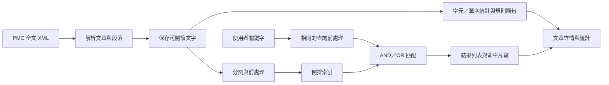

# IR HW1：作業需求解析與開發方案

> **2026-09-18 補充：本文件保留 2026-09-14 的原始方案與當時狀態，並非目前完成狀態。** 現行實作見 [README](README.md)；最新已完成並驗證的需求見 [搜尋調整規格](docs/SEARCH_REDESIGN.md)。新規格取代原方案的預設 AND 與保留全部停用詞決策，主畫面的 AND／OR／精準片語選單也已移除；講義也已取得並完成相關頁面核對。

建立日期：2026-09-14。作業期限：**2026-09-22**，PDF 未列確切時間。

本文件是待實作的開發方案；目前尚未建立可執行系統、下載正式語料或量測效能。已完整閱讀作業 PDF，並核對 PMC 官方資料服務文件。專案現況經知識圖譜及檔案清單確認：只有 `.git`，尚無應用程式。

作業依據：[homework-1-26-20260908.pdf](C:/Users/Huayi/Downloads/homework-1-26-20260908.pdf)，共 1 頁。以下「明確要求」來自作業；「方案決策」與「建議驗收」是為實作而訂，並非教師額外規定。

## 1. 你具體要做什麼

完成一套**生醫文章全文搜尋與文件統計系統**：先匯入一批 PMC 文章 XML，處理文字並建立索引；使用者輸入一個或多個關鍵字後，可以看到符合條件的文章、命中內容，以及字元數、單字數和句子數。你要能解釋搜尋與斷句方法，展示程式實際執行的結果。

例如使用者輸入 `cancer treatment`，系統能找到語料中符合查詢條件的文章，顯示標題與正文中的命中片段，並讓使用者開啟文章、查看統計及分句結果。

### 明確要求與對應成果

| 編號 | PDF 要求 | 具體要做的事 | 完成證據 |
| --- | --- | --- | --- |
| R1 | 個人作業；依系統表現與個人展示評量 | 自己掌握各元件的原理、程式與限制，準備獨立操作及解說 | 可重現的系統 demo 與說明 |
| R2 | 利用 ChatGPT、Claude 或 Gemini 實作 | 使用至少一種生成式 AI 協助開發，自己驗證結果 | 建議保留使用方式與驗證紀錄；PDF 未要求繳交完整對話 |
| R3 | 生醫資料、XML 格式；提供 PMC 網址 | 取得真實文章 XML，解析成可搜尋的文章內容 | 原始 XML、文章識別碼、資料來源紀錄 |
| R4 | Full-text retrieval，依 keyword(s) 檢索 | 支援單一與多個關鍵字，搜尋範圍涵蓋文章正文 | 僅出現在正文的詞也能命中 |
| R5 | 用容易理解的視覺方式顯示 | 建立可操作介面，清楚呈現結果與文章內容 | 搜尋結果列表及文章詳情 |
| R6 | 字元、單字、句子／EOS 等統計 | 計算每篇文章的字元數、單字數與句子數，說明計數定義 | 介面數值與可核對的例子 |
| R7 | 用 smart method 判斷句子數，例如 rule-based | 辨識句界，處理縮寫、小數等含句點但未結句的情況 | 分句清單、規則說明與測試 |
| R8 | 自行建構元件，使用 IR 課程基本 matching scheme | 自行實作核心匹配／檢索流程，能說明資料結構與匹配邏輯 | 核心原始碼及課堂方法對照 |
| R9 | 最後展示 system description、running results、system demo | 準備架構、演算法說明、真實執行結果與現場操作 | 說明文件、結果紀錄、demo |

### 允許的作法與未指定的事項

- **程式語言不限**。這句指 computer languages，並非要求支援所有自然語言。
- 可使用公開的基本前處理演算法，例如 Porter stemming、stop words。這些是允許採用的例子，沒有要求每一項都必須使用。
- rule-based 是合理斷句方法的例子，並非限定只能使用規則法。
- 文件沒有指定篇數、主題、資料期間、介面框架、排名公式、效能門檻、評分權重、報告頁數、簡報格式、繳交平台、壓縮檔命名或展示時長。
- 「easily visualization」表示結果應易於理解；長條圖、文字雲等特定圖表沒有被點名。
- 文件未要求向量資料庫、語意搜尋、聊天問答、即時爬取、帳號系統或雲端部署。

### 需要保留的歧義

1. PDF 寫 PubMed，但連結到 **PubMed Central（PMC）**。PMC 官方將它定位為生醫全文資料庫，因此本方案採 PMC 全文 XML，不把只有書目或摘要的資料當成全文。這是依網址和 full-text 目標所作的實作解讀。[PMC 官方介紹](https://pmc.ncbi.nlm.nih.gov/)
2. 原文出現 `both`，但沒有列出可辨識的兩個資料集，因此不能推定必須串接兩個來源。
3. 沒有提供課堂講義，尚無法確認老師所指的 basic matching scheme 具體是哪一種。暫採倒排索引與 Boolean AND／OR，交付前需與講義核對；若指定其他匹配法，再調整檢索模組。
4. 資料篇數、繳交規格、截止時間及 demo 時長，以課程平台的補充公告為準。這些未知項目不妨礙先實作核心功能。

## 2. 建議採用的完成範圍

**方案決策：Python + Streamlit、本機執行、英文 PMC 全文 XML、自己實作倒排索引與 AND／OR 匹配、自訂規則斷句。**

理由是資料處理、演算法與介面可以放在同一個 Python 專案，便於個人展示和解釋。Streamlit 提供互動元件、資料呈現與快取功能，適合此方案的介面需求。[Streamlit 官方入門](https://docs.streamlit.io/get-started)

| 優先級 | 方案中的功能 | 用途 |
| --- | --- | --- |
| P0 | PMC XML 匯入、正文解析、前處理、倒排索引、單詞與 AND／OR 查詢 | 涵蓋資料來源與基本檢索 |
| P0 | 搜尋介面、命中片段、文章詳情、三項統計、分句清單 | 讓結果可理解且可驗證 |
| P0 | 小型測試資料、錯誤處理、本機重啟、離線 demo、系統說明 | 確保能展示與重現 |
| P1 | Porter stemming 與 stop words 設定比較 | 展示前處理的影響 |
| P1 | TF-IDF cosine 排名、詞頻圖、CSV 結果匯出 | 增進排序與分析，時間充裕再加入 |
| P2 | 片語、NOT／括號語法、BM25、語意搜尋或聊天問答 | 後續延伸，不排入本次核心時程 |

篇數採**先 10–20 篇驗證，再擴充至約 100–300 篇**的工程目標；這不是作業規定。優先挑選有正文的英文研究文章，保存固定語料清單，避免展示時資料變動。

## 3. 系統流程與責任分工



建議的未來檔案配置如下，這些程式目前尚未建立：

```text
IR-HW1/
  app.py                       # Streamlit 介面
  ir_hw1/
    corpus.py                  # 官方 API 下載、manifest、去重
    xml_parser.py              # JATS / OAI 包裝解析與文字區塊
    preprocessing.py           # 分詞、大小寫、停用詞、stemming
    sentence_splitter.py       # 規則句界與可解釋原因
    statistics.py              # 字元／單字／句子統計
    index.py                   # 自建倒排索引
    search.py                  # 匹配及可選的排名
    snippets.py                # 命中片段與高亮
    storage.py                 # 資料、索引版本及重載
    cli.py                     # 下載、匯入、建索引、量測入口
  resources/stopwords.txt       # 附來源及版本
  data/raw/                    # 原始 XML
  data/processed/               # 標準化文章 JSONL
  data/manifest.jsonl           # 語料來源與匯入狀態
  data/index.json              # 本機索引快照
  tests/fixtures/              # 小型、可手算的合成測資
  tests/                       # 核心行為測試
  reports/                     # 實測結果及展示資料
  README.md                    # 安裝、啟動、資料與方法說明
  requirements.txt             # 實作時鎖定驗證通過的版本
```

核心物件約定：

- `Document`：PMCID、可選 PMID／DOI、標題、年份、原始檔位置、來源、授權資訊、文字區塊與統計。
- `TextBlock`：區塊 ID、類型、章節路徑、可閱讀文字；可區分正文、標題、圖說與表格。
- `Token`：原字串、正規化詞、區塊 ID、原文字元起訖位置。
- `Posting`：文件 ID、詞頻、命中位置；一個 term 對應多個文件。
- `SentenceSpan`：區塊 ID、起訖位置、原文、判定規則。
- `SearchResult`：文件 ID、符合的查詢詞、命中片段、可選分數。

## 4. 資料取得與 XML 解析

### 取得方式

先支援本機資料夾匯入 XML；下載器作為建置語料的工具，搜尋時直接使用本機語料與索引。

採 PMC 官方 OAI-PMH 的 `metadataPrefix=pmc` 取得允許重用的全文 JATS XML；可用 `set=pmc-open` 與 `ListRecords` 分頁，或依已選定 PMCID 使用 `GetRecord`。記錄並接續 `resumptionToken`，避免重抓。官方目前限制每秒最多 3 次且不可並行；方案設為單線每秒至多 1 次，超過 100 次請求的批次遵守官方離峰要求。下載保留文章授權與來源。[PMC OAI-PMH 文件](https://pmc.ncbi.nlm.nih.gov/tools/oai/)

PMC 已於 2026 年 8 月完成資料分發服務變更；實作以現行官方 API 為準，避免依賴舊 FTP 或已停用的 OA Web Service 教學。[PMC 更新公告](https://pmc.ncbi.nlm.nih.gov/about/new-in-pmc/)

下載失敗、非全文、已刪除紀錄、沒有正文、XML 不完整等狀態必須列入匯入報告。保留成功資料；錯誤不得默默變成空文章。對 429／暫時性伺服器錯誤採限次退避重試。

`manifest` 至少保存：PMCID、來源 URL、取得時間、SHA-256、授權、資料語言、匯入狀態／原因。固定清單後以本機快照展示。

### 解析與全文範圍

JATS 的文章可包含 `front`、`body`、`back` 與獨立的 `floats-group`；解析器須處理 OAI 回應外層與 XML namespace，不能假設 XML 根節點一定就是文章。[JATS article 結構](https://jats.nlm.nih.gov/archiving/tag-library/1.4/element/article.html)

本方案的預設搜尋範圍為：**標題、摘要、正文所有章節，以及圖表中的可抽取文字**。保留章節標題、段落、圖說、表格文字；處理獨立 floats-group，且同一內容只收錄一次。參考文獻與其他 back matter 分開保存，提供納入搜尋的後續選項。UI 明列目前範圍；PDF 沒有細定這些區域的取捨。

解析時保留行內標籤兩側文字與必要空格，避免 `<italic>` 等元素把單字接壞；區塊遍歷不得重複抽取巢狀段落。不進行圖片 OCR、公式語意解析或外部補充檔檢索，並在說明文件揭露範圍。

每篇必須能辨認唯一 PMCID，並有實際正文才納入主要 demo 語料。重複 PMCID 預設去重；相同 ID 內容變更時替換並重建索引。XML 解析關閉外部實體與外部 DTD 載入。

## 5. 前處理、索引與搜尋

### 文字保留與分詞

保留三層資料：原始 XML、可閱讀文字、供檢索使用的詞。統計與介面使用可閱讀文字，stemming 僅影響檢索詞。

基礎分詞以 Unicode 字母／數字為詞的主體，允許內部連字號與撇號；小數視為一個 token。確切規則與測例一起固定，例如 `IL-6`、`COVID-19`、`patient's`、`3.5`。不在第一版進行基因名稱同義詞或希臘字母轉寫。

P0 統一大小寫後建立索引，預設保留停用詞、關閉 stemming。P1 再提供停用詞與 stemming 的建索引設定；查詢必須使用同一設定。NLTK 的 PorterStemmer 有多種模式，實作明確指定模式並記入索引版本，避免結果依預設值改變。[NLTK PorterStemmer 文件](https://www.nltk.org/api/nltk.stem.porter.html)

停用詞表隨專案保存來源與版本。生醫語境的 `no`、`not` 等否定詞預設保留。變更任何前處理設定後重建索引，不允許查詢設定與索引不一致。

### 自建基本匹配

倒排索引保存 `term -> {doc_id: tf, locations}`。例如合成測資中 `cancer -> {D1, D2}`、`treatment -> {D2, D3}`，AND 結果為 D2，OR 結果為 D1、D2、D3。這個結構與集合操作便於對照 IR 基本方法。[倒排索引教材](https://nlp.stanford.edu/IR-book/html/htmledition/a-first-take-at-building-an-inverted-index-1.html)、[Boolean 查詢教材](https://nlp.stanford.edu/IR-book/html/htmledition/processing-boolean-queries-1.html)

| 情況 | 方案行為 |
| --- | --- |
| 一個詞 | 取該詞的 postings |
| 多詞 AND | 取全部詞的文件交集，先處理文件數較少的詞 |
| 多詞 OR | 取文件聯集，文件去重 |
| 重複查詢詞 | 去重，不重複顯示文件 |
| AND 含不存在的詞 | 回傳零篇，不能忽略不存在的條件 |
| OR 含不存在的詞 | 顯示其他詞的命中，提示未命中詞 |
| 空白／只有標點／前處理後無有效詞 | 顯示輸入提示，不回傳所有文章 |

多詞預設 AND，透過介面切換 AND／OR；P0 的文字輸入不支援布林運算式、引號片語或括號解析。遇到這類語法明確提示限制，避免讓使用者誤以為已執行特殊語義。

P0 依 PMCID 數值穩定排序，畫面標示「文章編號排序」，不宣稱相關性排名。核心匹配與索引自行實作；公開函式庫用於 XML、stemming、介面等基礎能力，檢索流程可在 demo 解釋。

### 可選排名

P1 在匹配到的候選集合內加入 TF-IDF cosine，不改變 AND／OR 的集合語義。若實作，方案固定：

```text
tf_weight = 1 + ln(tf)                         # tf > 0，否則 0
idf = ln((N + 1) / (df + 1)) + 1               # 本方案採用的平滑版本
w(t, d) = tf_weight(t, d) * idf(t)
score(q, d) = dot(wq, wd) / (norm(wq) * norm(wd))
```

文件向量範數使用文件的全部索引詞；查詢詞先去重，在既有詞彙空間組成查詢向量。零向量不計分，同分依 PMCID 排序。平滑式是方案決策，並非老師指定；對數 TF 的概念可參考原始教材。[Sublinear TF](https://nlp.stanford.edu/IR-book/html/htmledition/sublinear-tf-scaling-1.html)

命中片段以保存的原文位置產生；stemming 後命中仍高亮原字詞。片段選取命中附近的一至兩句，長句截短時標示省略。畫面文字先轉義再套用高亮。

## 6. 文件統計與智慧斷句

### 統計定義

| 統計 | 方案定義 |
| --- | --- |
| 字元數（含空白） | 可閱讀文字的 Unicode code point 數，非 UTF-8 位元組數；區塊內連續空白正規化為一個空格，區塊以一個換行相接 |
| 字元數（不含空白） | 排除空格、換行等空白字元後的數量，作為補充 |
| 單字數 | 使用既定分詞規則，於停用詞移除與 stemming **之前**計算，重複出現重複計數 |
| 句子數 | 在可閱讀的敘述段落／圖說／文字列表內以規則判斷句界後加總；非空尾段也計入 |
| 其他 | P1 可顯示不同詞數、平均句長與常見詞 |

句子數只計敘述文字；文章標題、章節標題、表格儲存格等非敘述區塊不硬算成句子。字元／單字數涵蓋預設搜尋範圍的文字，句子數另有敘述區塊範圍，介面需就地說明並提供區塊明細。這些定義是本方案決策，不能當成文件明訂標準。

### 規則斷句步驟

1. 在原文區塊標記候選結尾：`.`、`?`、`!` 與後方引號／括號。
2. 辨識小數、URL／DOI 內部句點、姓名首字母、稱謂與常見縮寫；用位置標記而非改寫字串，保留顯示用 offset。
3. 按上下文判斷縮寫是否也在句尾。例如 `Fig. 2` 不在 `Fig.` 後切開；`et al.` 不能無條件永遠排除句界。
4. 引號、括號與連續標點附在前一句；避免產生只含標點的句子。
5. 每個敘述區塊的非空尾段即使沒有句尾標點，也記為一個句子單位並保留此規則說明。
6. 回傳句子原文、位置與判定原因，讓介面和測試共用同一結果。

英文縮寫具有語境歧義，規則法不預設百分之百正確；展示實測成功案例與失敗案例。規則調整使用開發樣本，最終評估另用未參與調整的段落。

## 7. 介面方案

一個本機應用程式，分為三個檢視：

| 檢視 | 主要內容 | 使用者能做什麼 |
| --- | --- | --- |
| 搜尋 | 搜尋框、AND／OR、結果數、耗時、標題、PMCID、命中片段 | 輸入關鍵字、換頁、選文章 |
| 文章詳情 | 標題、來源、摘要、正文、高亮、三項統計、句子清單 | 檢查命中是否正確、核對句界與計數 |
| 語料概覽 | 匯入成功／失敗篇數、統計範圍、文件表、可選詞頻圖 | 了解資料來源、查看匯入錯誤與語料規模 |

查無結果、未建索引、語料為空時提供可理解的提示。資料與索引在啟動時載入並快取，不因 UI 每次重新執行就重新下載或建索引。展示完成後能重開程式，得到相同結果。

## 8. 驗收與評估方案

下表是建議的工程驗收，不是教師公布的評分表。

| 測項 | 方法 | 預期 |
| --- | --- | --- |
| 真實全文來源 | 檢查 PMCID、原始 XML、body、manifest | 每篇主要展示文章可追溯且有正文 |
| 正文命中 | 挑選只在 body 出現的詞 | 能找到該篇，片段來自正文 |
| XML 解析 | 測 namespace、OAI 包裝、行內標籤、巢狀段落、floats | 文字順序正確、不漏字、不重複 |
| AND／OR | 用上述 D1–D3 合成語料手算 | AND 為 D2；OR 為 D1、D2、D3 |
| 查詢邊界 | 大小寫、重複詞、未知詞、空查詢、全停用詞 | 符合第 5 節定義，不崩潰 |
| 前處理一致性 | 比較文檔和查詢輸出的詞；切換設定 | 設定一致，版本不符時要求重建 |
| 字元／單字 | 手算含空白、換行、小數、連字號的短字串 | 與已公開的計數規則一致 |
| 基礎句界 | `Cancer is common. Treatment helps!` | 2 句 |
| 小數與稱謂 | `Dr. Smith measured 3.5 mg. Results improved.` | 2 句 |
| 圖表縮寫 | `See Fig. 2 for details. Survival improved.` | 2 句 |
| 生醫縮寫 | `E. coli was detected. Treatment started.` | 2 句 |
| 無句尾標點 | `No adverse events were observed` 作為敘述區塊 | 1 個句子單位 |
| 高亮 | 大小寫、stemming 變體、HTML 特殊字元 | 位置對應原文、顯示安全正確 |
| 匯入容錯 | 重複 PMCID、壞 XML、缺 body、API error | 報告原因，成功資料仍可使用 |
| 重現 | 關閉網路、重啟、重建固定語料索引 | 核心 demo 可完成，結果可比對 |

正式結果紀錄分為三類：

1. **功能正確性**：合成語料做集合比對；實際全文做 body-only 命中核對。可用慢速逐篇掃描作驗證參照，需採相同詞規則。
2. **檢索效能**：記錄電腦環境、有效篇數、語料大小、建索引時間、索引大小；固定至少 20 個查詢，分開記錄冷啟動與載入後 median／p95 查詢時間。載入後 p95 < 1 秒是本方案的改善目標，尚未實測。
3. **斷句品質**：人工標記約 30–50 個真實段落的句界，保留開發／測試拆分；比較規則法與簡單句點切分的 boundary precision、recall、F1 及句數誤差，列出代表性失敗例。句數相同不代表句界都正確。

若做相關性排名，可對固定查詢人工標記相關文件並報 P@5；未完整標記整個集合時，不宣稱得到整體 Recall。任何數值都須由實際執行產生。

## 9. 開發順序與時間配置

以下以 2026-09-22 為期限倒排，9 月 21 日完成可交付版本。

| 日期 | 工作 | 階段完成條件 |
| --- | --- | --- |
| 9/14 | 整理需求與方案，確認課堂 matching 與補充公告 | 需求可對照、未指定事項已標明 |
| 9/15 | 專案骨架、10–20 篇 XML、parser 與 manifest | 真實文章正文可正確抽出 |
| 9/16 | 分詞、統計、規則斷句與測例 | 可核對三項統計和句子清單 |
| 9/17 | 倒排索引、AND／OR、索引儲存與重載 | 合成與真實語料搜尋通過 |
| 9/18 | Streamlit 搜尋、詳情、片段與高亮 | 使用者可完成搜尋到核對全文的流程 |
| 9/19 | 擴充語料、修正邊界；有餘裕才做 P1 | P0 穩定；新增功能不阻礙 demo |
| 9/20 | 正式效能與斷句評估、失敗案例分析 | 產出真實結果表與限制說明 |
| 9/21 | 系統文件、展示彩排、乾淨環境與離線測試 | 可依 README 重現並獨立說明 |
| 9/22 | 緩衝與依課程規定提交／展示 | 在實際截止時間前完成 |

若時程不足，保留所有 P0，暫緩排名、匯出與額外圖表。語料先以已驗證的固定集合完成核心展示，再擴充篇數。

## 10. 最後準備哪些成果

PDF 明確要求系統說明、執行結果及系統 demo，但未指定媒介。建議整理：

- **可執行原始碼與環境**：安裝／啟動方式、驗證通過的依賴版本、固定設定。
- **資料來源與語料清單**：真實 PMC XML、PMCID、授權、下載／匯入方法及失敗紀錄；依資料條款與課程需求決定是否打包原始資料。
- **系統說明**：流程、索引結構、匹配方法、統計定義、斷句規則、第三方元件與來源。
- **執行結果**：單詞、多詞、body-only 查詢、文章統計、句界示例、效能與斷句量測。
- **操作展示**：輸入查詢 → 切 AND／OR → 看命中 → 打開全文 → 核對統計與斷句 → 解釋原理。
- **個人解說準備**：能解釋倒排索引、AND／OR 差異、何以不能只數句點、前處理如何影響結果，以及有哪些限制。

可先按約 5 分鐘彩排，再依老師公告調整時長。建議在開發紀錄簡述 AI 協助範圍及自己的驗證／修改，便於回應個人展示問題；PDF 未將此紀錄指定為必交檔。

**開始實作的第一個里程碑：取得 10–20 篇真實 PMC 全文 XML，正確抽出正文，並用一個只出現在正文的詞完成可核對的本機搜尋。**
