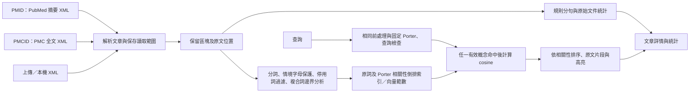

# 系統架構與方法

> 2026-09-18 已完成 [搜尋調整規格](SEARCH_REDESIGN.md)：主畫面固定相關性搜尋，索引 v5 包含停用詞過濾、生醫字母保護及通用複合詞匹配，已移除 COVID 別名表。原文與統計維持原定義，舊 AND／OR／PHRASE 保留後端／CLI 相容性。

> 2026-09-19 網頁固定啟用 Porter 詞幹處理，移除開關。直接使用既有 v5 詞幹索引，不需重建或重新下載；搜尋、排序及原文高亮採相同的詞幹結果。

## 資料流與責任

頁面同步提示、資料夾監看與主內容各使用固定容器；主內容由 `st.empty().container()` 整組替換，管理頁回饋亦固定在獨立位置，避免切換搜尋／下載及重跑時舊元件殘留。專案設定 `runner.fastReruns = false`，讓同一工作階段的重跑沿用同一執行器，避免快速連點時舊執行尚未釋放資料鎖、新執行就同時開始。跨程序寫入仍由既有 FileLock 保護。參考：[Streamlit 重跑設定](https://docs.streamlit.io/develop/api-reference/configuration/config.toml#runner)、[整組替換元件](https://docs.streamlit.io/develop/api-reference/layout/st.empty)。

文章詳情選擇器與搜尋結果閱讀區各使用 `st.fragment`；切換文章、章節或結果頁只更新閱讀區，不重跑整頁的同步與搜尋。每次互動先核對 raw 及快照檔案簽章，資料有變動才觸發整頁同步，避免使用過期文章。詳情使用固定替換容器，長文章切到短文章時清除舊內容。全站停用 Streamlit stale 元件的透明度過場，包含功能導覽、搜尋、文章詳情、語料概覽及文章管理；必要的處理進度文字仍正常顯示，元件的停用狀態也保留。參考：[Streamlit fragments](https://docs.streamlit.io/develop/api-reference/execution-flow/st.fragment)。

工作階段以 raw 內容簽章與快照版本記錄成功同步；資料未變時，切換功能或提交搜尋不再重複取得寫入鎖、讀取文章與索引，直接使用快取快照。同步失敗不記為成功，下次互動仍會重試；回收筒、永久刪除待處理紀錄及同步紀錄也納入快照失效檢查。raw 仍核對內容雜湊，因此檔案大小與修改時間相同的內容更動也能偵測。文章閱讀內容先組合成一個 HTML 區塊，再一次送到前端，減少逐段元件更新；各段仍保留 HTML 轉義、章節及查詢高亮。

`corpus.py` 只處理建置語料，搜尋沒有即時 HTTP。`xml_parser.py` 產生 `Document`／`TextBlock`；`preprocessing.py` 提供原始 tokenizer，`relevance.py` 在其後處理搜尋用詞彙，保留原文 offsets。`index.py` 建立及讀取倒排索引，`search.py` 決定候選集合，`snippets.py` 將位置映射回原文。`sentence_splitter.py` 提供帶原因的 SentenceSpan，`statistics.py` 與 UI 使用同一結果。`storage.py` 以 UTF-8 JSON/JSONL 保存，避免 pickle。

## 解析與統計範圍

每篇 `Document.content_scope` 保存 `abstract` 或 `full`。PMID（數字或 PMID 前綴）經 PubMed EFetch 取得摘要，不需要 PMC 對應；PMCID（PMC 前綴）經 PMC OAI 取得全文。上傳 JATS XML 預設 full，PubMed XML 固定 abstract；同步、重新啟動與還原沿用保存的範圍。沒有讀取範圍欄位的舊文章預設 full。

摘要模式僅擷取 JATS article-meta/abstract 或 PubMed Article/Abstract/AbstractText 的摘要正文；文章標題只作 metadata，結構式小標題只保存在區塊的 section 中供導覽，不建立 heading 文字區塊，不納入搜尋與統計。JATS 摘要模式僅保留 abstract 類型的文字區塊。全文模式包含標題、摘要、body 與 floats-group，back 另存而不索引或統計。body 可以省略，不作匯入門檻；摘要缺少時不以正文代替，只有小標題也視為沒有摘要正文，摘要統計為 0。解析／統計版本 `jats-source-scope-v6` 會觸發舊快照重建。兩種模式的搜尋共用 tokenizer、斷句器和原詞／Porter 倒排索引；摘要顯示的單字數另依空白分隔計算。

PubMed 身分只讀 MedlineCitation 的直接 PMID，以及 PubmedData 的直接 ArticleIdList；參考文獻內的同名清單不得覆蓋本篇身分。沒有 PMCID 時以 `PMID` 加數字作為本機 ID；有 PMCID 時沿用 PMCID。原始 XML 保留，來源 URL、取得時間、SHA 與讀取範圍可追溯。官方介面參考：[PubMed EFetch](https://www.ncbi.nlm.nih.gov/books/NBK25499/)。

以 local-name 處理 namespace，安全 XML parser 不解析實體、也不取用外部 DTD。由上而下遍歷，對已收錄段落不再重複遍歷；巢狀結構在各結構邊界 flush 一次。相同 XML `id` 的浮動物件僅抽取一次；無 id 的相同文字不任意去重，避免刪去不同語境的合法段落。行內 italic/bold 保留原有字串銜接，引用和連結邊界補空白，避免 `TBM<xref>2</xref>` 變成 `TBM2`。

| 統計 | 定義 |
| --- | --- |
| 字元（含空白） | 區塊文字先壓縮內部連續空白，再以一個 `\n` 連接所有搜尋區塊，取 Unicode code point 數；不是位元組數 |
| 字元（不含空白） | 上述字串排除 Python `isspace()` 認定的字元 |
| 單字 | 摘要模式使用 `len(block.text.split())` 加總，空白、換行及 Tab 都是分隔，獨立符號也算一個單位；全文模式使用 tokenizer。兩者皆在停用詞或 stemming 之前計算，重複出現重複計數 |
| 句子 | 讀取範圍內敘述文字的分句單位加總；標題與表格儲存格不計；非空尾段也計一個 |

例如文章標題為 `IL-6`，摘要只有 `Dose 3.5 mg.`，統計為 12 個字元（含空白）、10 個字元（不含空白）、3 個單字、1 個句子；文章標題不計入。區塊表中的字元相加不含區塊間換行，因此會比摘要總字元少 `區塊數 - 1`（非空摘要）。

## 分詞、停用詞與搜尋概念

tokenizer 保留 Unicode 字母、數字、結合符號、詞內連字號／撇號與小數，執行 NFC、casefold 及常見連字號正規化；每個 token 保存原文起終點。`COVID-19`、`IL-6`、`patient's`、`3.5` 各為完整 token。原始 tokenizer 仍供全文字數與舊匹配 API 使用，摘要字數另採空白分隔，兩者皆不受搜尋過濾影響。

`relevance.py` 的 `relevance_tokens` 共用同一套文件／查詢分析：檢查空白相鄰上下文，保護 `vitamin A/B/C`、`hepatitis B/C`、`B/T cell(s)` 的字母，再以 `compound_parts` 從原文的連字號與字母／數字交界切分，逐段正規化並保存位置。停用詞及未保護的孤立 ASCII 字母不作獨立特徵；非 ASCII 單字母不受此規則刪除。只有無效部分的複合詞（如 `and-of`、`a-b`）也不搜尋。

`resources/search_vocabulary.json` 是專案自行編寫的保守清單，版本為 `biomedical-search-v2`，僅保存來源說明、停用詞、字母上下文，不含搜尋別名。`RELEVANCE_PREPROCESSING` 記錄 `relevance-v2`、`hyphen-letter-number-v1`、tokenizer 及清單 SHA-256。`and/of/the/a` 等被過濾，`no/not/without` 沒有列入停用詞；保留否定詞不代表具備布林或語意否定能力。

邊界為 `-`／`‐`／`‑`，或 Unicode 字母（含結合符號）與數字的交界，部分以 `-` 連接成完整詞。例如 `COVID19`／`COVID-19` → `covid-19`，`IL6`／`IL-6` → `il-6`，`H1N1` → `h-1-n-1`；撇號與小數維持原 tokenizer 規則。文件用 `include_components=True`，除完整詞外保存有效單一部分；查詢用預設 `False`，每個 token 僅保留完整條件。這個有意的表示差異讓 `covid` 找到 `COVID-19`，但 `covid-19` 不會退化成「covid 或 19」。`HIV-1` 不匹配 `HIV-2`，也不跨空白或文字區塊拼成完整詞。沒有疾病名稱特例、任意子字串、CamelCase 拆解或任意連續部分的組合索引。

Porter 使用既有 NLTK `MARTIN_EXTENSIONS`，在邊界分析及過濾後只處理純 ASCII 字母特徵，例如 `therapies` → `therapi`；完整 `therapies-2` 保留，但其中的字母部分可供 `therapy` 匹配。原文、分句及統計不經詞幹處理，也不需下載模型或 NLTK 語料。

## 倒排索引與候選文章

索引 v5 的資料結構仍為 `term -> {doc_id: {tf, locations: [[block_id, start, end], ...]}}`。完整詞及部分各有自己的原文 Unicode 位置，起點含、終點不含。保存四組 postings 及對應向量資料：

| 用途 | 原詞 | Porter |
| --- | --- | --- |
| 相關性搜尋 | `relevance_postings`、`relevance_tfidf`（API／CLI 相容） | `porter_relevance_postings`、`porter_relevance_tfidf`（網頁固定使用） |
| 舊 API／CLI 相容 | `postings`、`tfidf` | `porter_postings`、`porter_tfidf` |

一次原子寫入發布四組資料。新版主畫面呼叫 `search(index, query, "RELEVANCE", stemming=True)`，頁首索引詞彙數亦以 Porter 相關性索引計算。CLI 未指定模式時亦採 RELEVANCE，但保留既有 `--stemming` 選項；須加該參數才與網頁相同。取有效詞 postings 的聯集作為候選，不要求全部詞同時命中。全部未知詞回傳無結果；有未知詞時顯示提示並保留其他有效命中。

空白、純標點或全部停用詞回傳空集合與有效關鍵字提示。只剩孤立英文字母則提示補充完整名稱。`vitamin A` 等上下文可正常搜尋。畫面不提供匹配模式、排序選單或 Porter 開關，所有查詢自動使用詞幹處理。舊工作階段的 `stemming` 值會清除，並重設分頁與已選文章，避免保留舊結果；`search_controls` 只保存查詢文字。

載入快照會檢查索引／前處理／parser／句界版本、文章 fingerprint、四組 postings、詞彙／文件鍵及 IDF／範數的有限數值範圍。網站或 CLI 同步時發現 v3／v4 舊索引、規則版本或清單雜湊不一致，從本機文章重建；不重新下載，也不為此次升級改寫原文或統計。詞彙清單變更後應重新啟動程式並同步／build，確保載入最新規則。

新增、修改、刪除、還原與資料夾同步沿用集中式 `build_index`，四組資料同步更新。既有工作階段的 `(query, mode)` 轉成只保留 query，以新規則重新搜尋，不保留已移除的模式控制項。

## 相關性計分與高亮

`tfidf.py` 使用 `tf_weight = 1 + ln(tf)`、`idf = ln((N + 1) / (df + 1)) + 1`，再計算查詢與文件的 cosine similarity。N 包含沒有有效搜尋詞的文章；文件範數計入整篇有效詞，停用詞與未保護的孤立字母不影響新版分數。原詞與 Porter 在各自合併後的詞彙空間獨立計算。未知查詢詞不加入向量，查詢 TF 固定為 1。

完整詞與組成部分是不同向量特徵，均納入文件範數，例如一次 `IL6` 分別提供 `il-6`、`il`、`6`。普通詞只產生一次；同一特徵的同一原文位置去重，不因正規化寫法增加 TF；`risk-risk` 的兩個 risk 位於不同位置，仍計兩次。查詢依完整正規化條件去重，`IL6 IL-6` 與 `IL6` 分數相同。`covid` 與 `covid-19` 條件不同，不保證結果或分數相同；此次增加特徵也可能改變舊版分數。

RELEVANCE 強制使用 cosine，僅列出正分數候選；依完整分數遞減、同分依文章 ID 排列，沒有 10% 等任意門檻。介面顯示 `相關性：{score:.0%}`，低正分數可能四捨五入為 0%。分數不是正確率、相關機率或語意理解，不同查詢及語料版本的分數不宜直接比較。

片段與詳情指定同一組 relevance／Porter postings，直接使用命中特徵的位置。`covid` 只高亮 `COVID-19` 的 `COVID`；`covid19`／`covid-19` 高亮完整原詞；`risk` 只標示 `high-risk` 的 risk。已移除別名專用的高亮修補，舊呼叫不傳 query 也能取得部分位置。位置在正規化前從原文取得，因此 NFC／casefold 改變長度仍正確。片段優先選非標題區塊，再依命中數與區塊順序挑兩處；HTML 先轉義再插入 mark，重疊範圍合併，維持既有長片段處理。

## 舊匹配 API／CLI 相容範圍

底層 `search` 未傳 mode 時仍保留舊 AND／文章 ID 排序預設；新版 UI／CLI 明確傳 RELEVANCE。呼叫 AND／OR／PHRASE 時使用原始 postings 及既有停用詞政策，支援 `ranking="tfidf"` 對該模式的命中集合排序。

CLI 可明確指定 `--mode AND`、`--mode OR`、`--mode PHRASE`。AND 取交集，OR 取聯集，PHRASE 再核對同區塊連續位置、原始詞序及僅空白間隔；保留停用詞，停止套用 Porter。PHRASE 的成對外層引號及 `phrase_locations` 屬舊相容 API，並非新網頁的引號搜尋功能。

新網頁遇到引號／括號或全大寫 AND／OR／NOT 時提示不解析特殊語法，仍以一般關鍵字處理。未增加任意布林運算式、語意模型或進階模式選單。

## 自訂句界

1. 找 `.?!` 及跟隨的引號、閉括號；連續標點一起保留。
2. 保護數字間小數點，URL、DOI、email 內部句點；末尾語句標點保留為候選。
3. 稱謂及引導縮寫如 `Dr.`、`Fig.`、`e.g.`、`i.e.` 在區塊中不切開；圖號、姓名及菌名可接續。
4. 姓名首字母、菌名 `E. coli` 等通常接續；`et al.`、`etc.`、部分量詞和點分縮寫看後字是否大寫作啟發式判斷。
5. 引號或閉括號隨前句；只有標點的片段不計句。
6. 剩餘有字母或數字的尾段算一單位，原因為 `paragraph_end`。

回傳 `start`、`end`、`text`、`rule`，不改寫輸入字串。規則理由包含 `terminal_punctuation`、`abbreviation_context_boundary`、`paragraph_end`。

這是易於解釋的啟發式，並非完美斷句。`The U.S. Food and Drug Administration approved it.` 會在 U.S. 後誤切；縮寫後用小寫開始新句可能被合併。沒有用詞幹或模型掩飾這類歧義。句界評估以 offset precision／recall／F1 比較，不能只以句子總數相等判定正確。

## 持久化及操作界線

單次 JSON/JSONL 快照以同目錄暫存檔、flush、fsync、原子 replace 寫入。語料與索引不是跨檔案交易，但索引保存完整 corpus fingerprint，UI 不會使用不一致的組合。CLI 與網站匯入共用檔案鎖；Streamlit 載入後快取，檔案時間／大小改變才重載。manifest 是 append-only 事件紀錄，不取代文章快照；程式被強制中斷時可從 raw 重建。

`sync.py` 在網站啟動及每次 Streamlit rerun（包含重新整理、提交搜尋）檢查 `data/raw` 直下 XML 的 SHA-256。新增或內容變更者使用既有 parser 匯入；文章快照與索引不一致、缺少索引或索引格式損壞時，自動重建。頁面開啟時另以 Streamlit fragment 每 3 秒檢查檔名／內容雜湊，變更即觸發全頁同步；瀏覽器背景或休眠可能延遲，搜尋前仍強制同步。CLI search／stats／build 也先同步。此流程沒有網路請求，適用小型語料。相同內容不重寫快照、索引或重複追加失敗事件；`raw_sync_state.json` 保存雜湊、解析規則版本及上次結果，可重新生成，不納入版本控制。

可搜尋文章必須對應 raw 中實際存在的有效 XML。失去所有有效來源（移出、刪除、壞檔或多篇檔中移除 article）時，從文章快照及四組索引移除，將既有文章備份以 `reason=source_missing` 留在回收筒；來源重新有效時自動加入。一般網頁刪除沒有此自動還原標記，因此不會被同步復活。若仍有另一份有效來源，改用其實際內容並更新來源路徑／雜湊；改名也會更新路徑，不會因為舊檔名消失而誤刪整篇。解析規則變更時重解析；失效來源不冒用舊統計。writer lock 忙碌時暫不展示舊搜尋結果。

若同一資料夾有同 PMCID 的不同 XML，依匯入順序最後處理版本勝出；自動同步只處理本次變更檔案，依檔名排序。建議每個 PMCID 保留一份 XML 並直接更新該檔。大量語料時需要改為增量索引／更適合的位置壓縮與磁碟格式；目前未量測數百至百萬篇規模。

2026-09-18 已核對課堂講義的倒排索引、布林查詢、分詞及排名介紹，頁碼與界線見 [搜尋調整規格](SEARCH_REDESIGN.md)。現行核心入口為 `search.search(index, query, mode)`；matching 在該模組、TF-IDF 計算在 `tfidf.py`。網頁已採用新版有效詞聯集候選與前處理規則，舊模式則保留原條件。未做人工作業相關性標註，不能據此宣稱排序品質提升多少。

## 文章管理與刪除狀態

`ui_management.py` 提供上傳、PMID 下載、刪除／還原三個分頁；`library.py` 協調檔案保存、既有 parser 與四組索引。空資料庫仍能進入管理頁，上傳後立即可搜尋。語料 fingerprint 改變時重設搜尋分頁與已開啟文章，避免沿用已刪除的結果。

2026-09-21 新增 PMID TXT 清單：下載分頁先由 `pmid_list.parse_pmid_list` 解碼及逐行驗證，忽略空行並依首次順序去重；可接受 UTF-8 BOM 及帶 BOM 的 UTF-16，限制 1 MiB／100 個不同 PMID。無效行會阻止下載並指出行號。上傳只預覽，按批次下載才呼叫 `library.download_pmids`。PMID 一律取得摘要，包含沿用既有同篇全文切換為摘要的規則。

單篇與批次共用 `_download_article`；批次在同一組下載鎖／writer lock 內，每 20 個待下載 PMID 合併為一次 EFetch 請求。依官方支援的逗號分隔 ID 清單取得回應（[EFetch 文件](https://www.ncbi.nlm.nih.gov/books/NBK25499/#chapter4.EFetch)），整批共用一個 `PMCClient`、1 秒最小請求間距及 100 次 HTTP 嘗試預算，重試計入預算。先重用已存在文章，再依 PMID 對應回應，忽略非請求 ID，拒絕重複 ID、缺少的 ID 與非英文文章；合格元素拆成單篇 XML 保存，原文／結構不變，序列化格式不保證與 API 原始位元組相同。沒有改寫既有 raw XML。

每篇成功後立即保存 XML 與文章；最後在 `finally` 統一更新索引，因此部分成功後遇到下載或儲存失敗也會嘗試發布已完成資料。文章格式／語言錯誤不阻斷同批其他篇；服務或網路錯誤停止後續批次，避免逐篇倍增重試等待，儲存錯誤則直接回報。畫面提供進度與逐篇結果，重送時跳過已存在同範圍文章。離線展示啟動器設定 `IR_HW1_OFFLINE_DEMO=1`，UI 明示並停用下載，後端也會立即阻擋；需重啟一般模式才能下載。TXT 不作為文章正文或 raw 自動同步來源。

上傳檔名不作為磁碟路徑；以 SHA-256 命名保存，防止同名覆寫及路徑穿越。每檔最多 25 MiB，多篇 XML 逐篇記錄結果，無有效文章的檔案留在 rejected。PMID 直接由 PubMed EFetch 取得摘要，PMCID 經 PMC OAI 取得全文；共用單線、有重試與上限的 PMCClient。確認 PMID／PMCID、讀取範圍及英文後才進入 raw，PMC 全文另檢查 CC 授權。成功／失敗與來源都寫入 manifest；本機已存在且範圍相同者不重複下載。

刪除採可還原方式：先原子寫入 `deleted_articles.json` 的文章備份與刪除時間，再更新有效文章及原詞／Porter 索引。所有文章載入都排除這些 PMCID，因此中斷或重啟後不會誤搜到已刪除文章；raw 同步與 CLI 匯入會略過回收筒中的 ID。刪掉全部文章時仍保存有效的空索引。回收筒是本機狀態；移機時需連同整個資料目錄備份。

還原先保存文章，再移除刪除標記並重建索引；必須在 raw 找到有效全文，不能只靠文章備份產生無來源的搜尋結果。每次批次還原每個 XML 只解析一次，優先採原來源，也接受改名或有效副本；缺少任何所選篇時，在寫入前指出需補回的 ID。多篇 XML 可只還原其中一篇。重新上傳或以 PMID 明確下載同篇也會解除刪除標記。上述操作共用 writer lock；跨檔案寫入中斷時，既有 fingerprint 檢查會促使下次啟動修復索引。

管理介面使用勾選表格：本機文章與回收筒各有 PMCID／標題篩選、全選目前列表與清除全部選取。篩選可保留跨列表選取，但按鈕與計數明確顯示總篇數；選取以 PMCID 保存，不依可變列號執行。回收筒同一組選取可還原或永久刪除，全選即可批次清空。變更永久刪除的選取集合後，確認勾選會重設。一次服務呼叫處理整批，索引只發布一次，操作後仍留在原管理分頁。

`purge.py` 只接受回收筒中的 ID，永久刪除需要網頁勾選確認。清理 raw／rejected 直下可辨識的 XML：單篇或全部命中的檔案移除，多篇檔只移除指定 article 節點，保留 namespace 及其他文章。共用檔重新序列化後更新仍使用該檔的文章 SHA，保留其他文章的既有內容，防止歷史版本覆蓋新上傳版。操作紀錄及原來源仍留在 manifest，不是可還原的全文備份。

先完成檔案解析、路徑範圍與大小檢查，再寫入 `purge_pending.json` 清理計畫。該計畫只含刪除後保留的 XML／文章與必要的檔案雜湊；未完成前拒絕載入有效語料，網站啟動時在 writer lock 下重試。檔案刪除／改寫、文章快照、回收筒、四組索引、manifest 完成後才刪除計畫及過期同步快取；重試以雜湊和事件 ID 避免誤覆寫、重複紀錄。若原檔被外部修改或恢復紀錄損壞，會停止並提示，不冒用半套資料。

這是本機檔案刪除，不是安全抹除磁碟、Git 歷史或使用者外部備份；無法辨識的無關壞 XML 不會任意刪除。永久刪除完成後仍可明確重新上傳／下載該篇，這屬新的匯入。

上傳更新同一 PMCID 可能保留多份原始版本；manifest 已成功處理且內容未變的舊檔不會在同步快取遺失時重播，避免蓋掉最新匯入內容。使用者直接修改舊檔仍視為新的匯入動作。限制仍為小型本機語料，每次變更重新建立四組索引；本次未增加伺服器驗證或多人權限管理。

## 第三方用途

Streamlit/Pandas：介面與表格；requests/truststore：HTTP 與系統信任憑證；defusedxml：安全 XML；regex：Unicode 字元屬性；NLTK：Porter 詞幹還原；filelock：CLI 寫入與下載鎖；pytest/AppTest：驗證。倒排索引、集合匹配、統計、規則斷句、高亮位置映射由本專案程式實作，未使用全文搜尋引擎或 NLP 預訓練斷句模型。

資料服務依 [PMC OAI-PMH](https://pmc.ncbi.nlm.nih.gov/tools/oai/)，XML 結構參考 [JATS article](https://jats.nlm.nih.gov/archiving/tag-library/1.4/element/article.html)，UI 測試依 [Streamlit AppTest](https://docs.streamlit.io/develop/api-reference/app-testing/st.testing.v1.apptest)。
